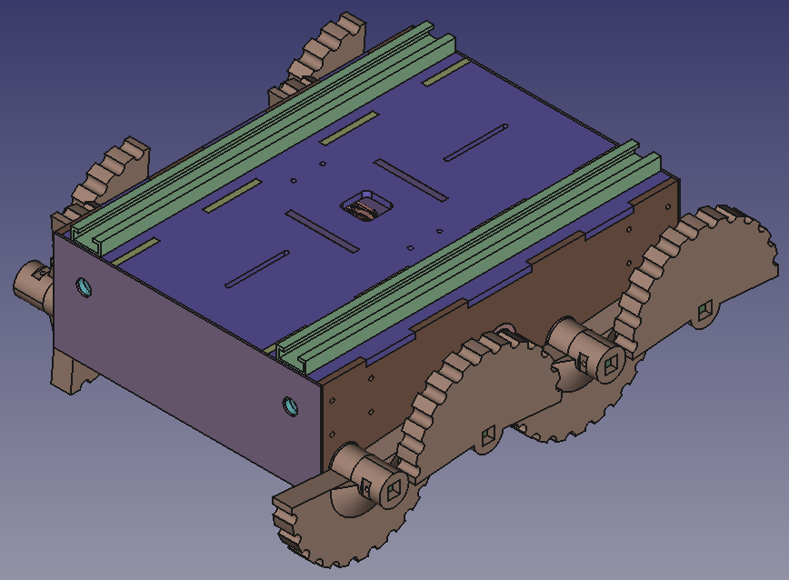

# Q-Octo CAD
This Repo is the official home of the design of the Q-Octo robot! All CAD is using `FreeCAD Link Branch 2024-01-23`, but STL and DXF files are also provided

## Parts List

### Parts to Purchase

- 2x CyberGear MicroMotor (Robot Dog Motor)
- 12mm Square Tube, Aluminum, Hollow (~1 meter, you need to cut it yourself)
- Assorted M4 bolts, ideally low profile
- M4 threaded inserts, diameter 5.6mm
- 20x 61704 ball bearings (20x27x4mm)
- 4x 5mm HTD belts 285mm length, 15mm wide
- 4x 5mm HTD belts 225mm length, 15mm wide
